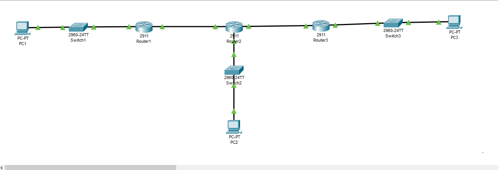

# Enterprise Network Routing with OSPF

## Overview

This project demonstrates a small enterprise network
designed and configured using Cisco Packet Tracer.

The network consists of three routers connecting three
separate LANs. OSPF is used as the dynamic routing
protocol to exchange routing information between the
routers.

## Network Topology



## Objectives

- Configure IPv4 addressing
- Configure routers and switches
- Configure OSPF dynamic routing
- Configure OSPF Router IDs
- Verify OSPF neighbor relationships
- Verify routing tables
- Test end-to-end connectivity
- Test OSPF interface cost
- Test link failure and recovery

## Devices Used

| Device | Model | Quantity |
|---|---|---:|
| Router | Cisco 2911 | 3 |
| Switch | Cisco 2960-24TT | 3 |
| PC | PC-PT | 3 |

## IP Addressing

| Device | Interface | IP Address | Subnet Mask |
|---|---|---|---|
| R1 | G0/0 | 192.168.10.1 | 255.255.255.0 |
| R1 | G0/1 | 192.168.1.1 | 255.255.255.252 |
| R2 | G0/0 | 192.168.1.2 | 255.255.255.252 |
| R2 | G0/1 | 192.168.2.1 | 255.255.255.252 |
| R2 | G0/2 | 192.168.20.1 | 255.255.255.0 |
| R3 | G0/0 | 192.168.2.2 | 255.255.255.252 |
| R3 | G0/1 | 192.168.30.1 | 255.255.255.0 |

## PC Addressing

| PC | IP Address | Default Gateway |
|---|---|---|
| PC1 | 192.168.10.10 | 192.168.10.1 |
| PC2 | 192.168.20.10 | 192.168.20.1 |
| PC3 | 192.168.30.10 | 192.168.30.1 |

## OSPF Configuration

OSPF process 1 was configured on all routers.

| Router | Router ID |
|---|---|
| R1 | 1.1.1.1 |
| R2 | 2.2.2.2 |
| R3 | 3.3.3.3 |

All routers operate in OSPF Area 0.

## OSPF Verification

The following commands were used:

```text
show ip ospf neighbor
show ip route
show ip ospf interface
show ip protocols
